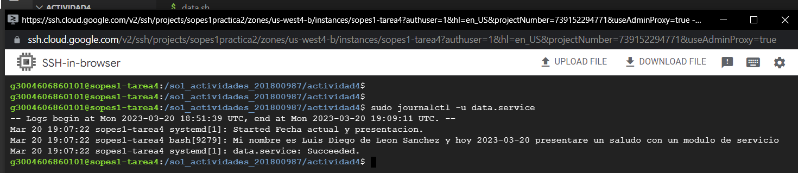

# ACTIVIDAD 4

Para ejecutar un servicio, se necesita crear un archivo *.service que se guardara en el directorio ```/etc/systemd/system``` para que el mismo pueda ejecutarse y mostrar lo que se le describio en un archivo *.sh que se explicara a continuacion como es su creacion.

> Se debe crear un archivo con cualquier nombre pero con terminacion .sh el cual contendra el mensaje que se desea desplegar una vez se haya guardado y ejecutado el servicio.
> En este caso creare un archivo llamado ```data.bh``` el cual contendra la siguiente informacion:

```
#!/usr/bin/bash
echo "Mi nombre es Luis Diego de Leon Sanchez y hoy $(date >+'%Y-%m-%d') presentare un saludo con un modulo de servicio"
```

> Luego de haber introducido la informacion deseada en este caso sera mi nombre y la fecha actual, se procede a crear un archivo .service el cual contendra la ruta del archivo .sh e instalara/iniciara el modulo guardado en la ruta /etc/systemd/system cada que se desee.

La estructuda del archivo es la siguiente:

```
[Unit]
Description=Fecha actual y presentacion

[Service]
Type=simple
ExecStart=/usr/bin/bash /pathFile/data.sh

[Install]
WantedBy=multi-user.target
```

> En donde en la variable ```pathFile``` se le indicara cual es la ruta especifica en donde el archivo .sh que se creo con anterioridad, esta guardado.

> Por ultimo se describira una serie de comandos que se deberan ejecutar para mostrar la descripcion que guardamos en el archivo .sh creado.

```
sudo cp data.service /etc/systemd/system/ # sirve para copiar el archivo .service hacia el directorio descrito
```

```
sudo systemctl enable data.service # sirve para activar el servicio para ser leido
```

```
sudo systemctl start data.service # sirve para iniciar un servicio que ya se encuentra activado
```

Por ultimo para ejecutarlo y visualizar su mensaje se ejecuta:

```
sudo journalctl -u data.service
```

El comando anterior desplegara el siguiente resultado:




De esta manera se evidencia la correcta creacion y ejecucion de un servicio y de los mensajes que uno desea que se muestren.